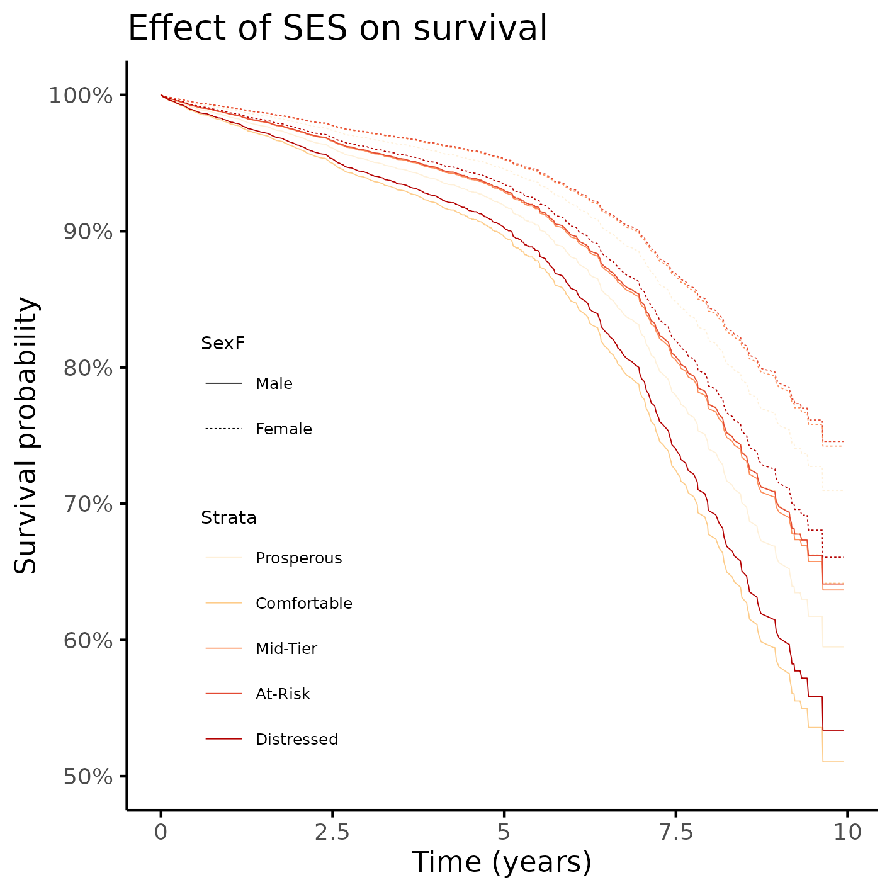
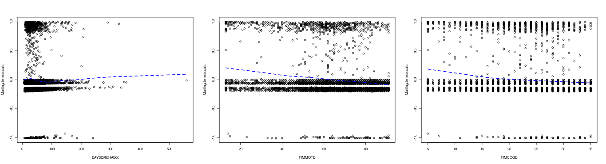
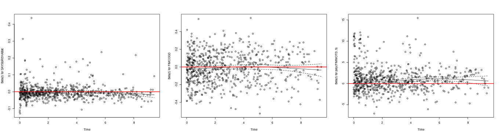
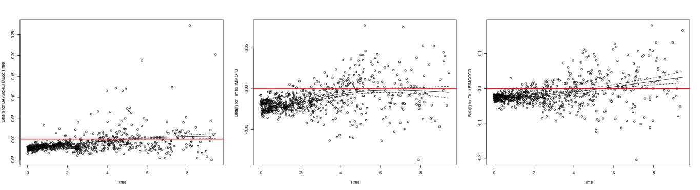

---

\newpage

**Time-adjusted effect of socioeconomic status in mortality rates after brain injury: cohort study**

**Document version**

|Version |Alterations     |
|:-------|:---------------|
|01      |Initial version |

---

# Abbreviations

- FIM: Functional Independence Measure
- HR: hazards ratio
- SD: standard deviation
- SES: socioeconomic status

# Context

This analysis expands on a previous analysis with a similar objective (**SAR-2023-004-BH-v02**), by employing more flexible modeling strategies to include time-dependent covariates that were dropped from the previous analysis.
In the process the raw FIM scores were substituted by their quartiles.

## Objectives

To determine the effect of socioeconomic status of the neighborhood on mortality of patients with brain injury, accounting for time-dependent covariates.

<!-- ## Data reception and cleaning -->

# Methods

The data procedures, design and analysis methods used in this report are fully described in the annex document **SAP-2023-016-BH-v01**.

<!-- ## Study parameters -->

<!-- ### Study design -->

<!-- ### Inclusion and exclusion criteria -->

<!-- ### Exposures -->

<!-- ### Outcomes -->

<!-- ### Covariates -->

<!-- ## Statistical analyses -->

This analysis was performed using statistical software `R` version 4.3.0.

# Results

## Study population and follow up

There initially were 76,665 observations on 19,303 study participants considered for inclusion.
After excluding follow up measurements during the COVID-19 pandemic to mitigate confounding on mortality causes there were 69,440 observations left in the study sample.
After applying the inclusion criteria for the study period between 2010-01-01 and 2018-12-31 and considering the status at the last available follow up time for each individual a total of 7,414 participants were included in the analysis.

The epidemiological profile of the participant included in the study was a
male participant (417 (74%))
with an average (SD) age of 43 (20) years.
<!-- The average (SD) time of follow up was -->
<!-- 3.06 -->
<!-- (1.94) -->
<!-- years. -->

Races were not homogeneously available in the study population with
315 (56%) individuals being white;
288 (52%) were single (never married) at the time of injury,
and most participants were well educated with 208 (38%) at greater than high school level.
A total of 334 (60%) were employed and
287 (53%) participants lived in an urban area.

Table: **Table 1** Epidemiological, demographic and clinical characteristics of study participants.

|                                        **Characteristic**                                        | **N = 564** |
|:------------------------------------------------------------------------------------------------:|:-----------:|
|                                     __SES quintiles, n (%)__                                     |             |
|                                            Prosperous                                            |  69 (15%)   |
|                                           Comfortable                                            |  88 (19%)   |
|                                             Mid-Tier                                             |  97 (21%)   |
|                                             At-Risk                                              |  119 (26%)  |
|                                            Distressed                                            |  91 (20%)   |
|                                             Missing                                              |     100     |
|                                         __Sex:, n (%)__                                          |             |
|                                               Male                                               |  417 (74%)  |
|                                              Female                                              |  146 (26%)  |
|                                             Missing                                              |      1      |
|                                  __What is your race?, n (%)__                                   |             |
|                                              White                                               |  315 (56%)  |
|                                              Black                                               |  97 (17%)   |
|                                             Hispanic                                             |  120 (21%)  |
|                                              Other                                               |  30 (5.3%)  |
|                                             Missing                                              |      2      |
|                             __What is your marital status?, n (%)__                              |             |
|                                      Single (Never Married)                                      |  288 (52%)  |
|                                             Married                                              |  153 (27%)  |
|                                             Divorced                                             |  65 (12%)   |
|                                            Separated                                             |  20 (3.6%)  |
|                                             Widowed                                              |  31 (5.5%)  |
|                                              Other                                               |  2 (0.4%)   |
|                                             Missing                                              |      5      |
|                                   __Age at Injury, Mean (SD)__                                   |   43 (20)   |
|                                             Missing                                              |      2      |
|                                 __Substance Problem Use, n (%)__                                 |  228 (43%)  |
|                                             Missing                                              |     33      |
|                                       __Education, n (%)__                                       |             |
|                                     Greater Than High School                                     |  208 (38%)  |
|                                      Less Than High School                                       |  142 (26%)  |
|                                         High School/GED                                          |  204 (37%)  |
|                                             Missing                                              |     10      |
|                  __At time of injury, what was your employment status?, n (%)__                  |             |
|                                             Employed                                             |  334 (60%)  |
|                                            Unemployed                                            |  76 (14%)   |
|                                              Other                                               |  146 (26%)  |
|                                             Missing                                              |      8      |
|                __Urbanization based on zip code of address at discharge., n (%)__                |             |
|                                             Suburban                                             |  145 (27%)  |
|                                              Rural                                               |  107 (20%)  |
|                                              Urban                                               |  287 (53%)  |
|                                             Missing                                              |     25      |
| __Prior to this injury, has a physician ever told you that you have a seizure disorder?, n (%)__ |  7 (6.0%)   |
|                                             Missing                                              |     447     |
|                                  __Spinal cord injury:, n (%)__                                  |  22 (3.9%)  |
|                                             Missing                                              |      4      |
|                                   __Cause of injury:, n (%)__                                    |             |
|                                            Vehicular                                             |  266 (48%)  |
|                                             Violence                                             |  59 (11%)   |
|                                              Falls                                               |  171 (31%)  |
|                                              Other                                               |  64 (11%)   |
|                                             Missing                                              |      4      |
|                             __Primary rehabilitation payor:, n (%)__                             |             |
|                                        Private Insurance                                         |  237 (42%)  |
|                                         Public Insurance                                         |  235 (42%)  |
|                                              Other                                               |  90 (16%)   |
|                                             Missing                                              |      2      |
|                           __Residence after rehab discharge:, n (%)__                            |             |
|                                        Private Residence                                         |  441 (80%)  |
|                                              Other                                               |  112 (20%)  |
|                                             Missing                                              |     11      |
|                        __Days From Injury to Rehab Discharge, Mean (SD)__                        |   41 (28)   |
|                           __FIM Motor at Discharge quartiles, n (%)__                            |             |
|                                                Q1                                                |  110 (20%)  |
|                                                Q2                                                |  150 (27%)  |
|                                                Q3                                                |  139 (25%)  |
|                                                Q4                                                |  150 (27%)  |
|                                             Missing                                              |     15      |
|                         __FIM Cognitive at Discharge quartiles, n (%)__                          |             |
|                                                Q1                                                |  143 (26%)  |
|                                                Q2                                                |  143 (26%)  |
|                                                Q3                                                |  120 (22%)  |
|                                                Q4                                                |  149 (27%)  |
|                                             Missing                                              |      9      |

The observed overall mortality was 13.5% in the study period.
The distribution of cases appear homogeneous across SES quintiles (Figure 1), ranging from 10.6% to 13.5%.
We will test the effect of SES quintiles on the hazard rate in the next section.
See also Figure A2 in the appendix for the distribution of sexes in each SES quintile in the study population.

**Figure 1** Proportion of cases per SES quintiles.

## Time-adjusted effect of SES on mortality

Following the findings of **SAR-2023-017-BH-v01** the multiple observations per individual should be favored where the time-varying SES exposure allows the full model specification in this analytical plan to be used.
This analysis, however includes an additional model with interactions between the two FIM scores and the exposure that renders those findings obsolete, given that with this new specification all terms satisfy the proportional hazards assumption.
This is the model that will be described in this section.

The previous seizure disorder diagnosis was missing for most of the study population and was not included in the model as a covariate to preserve study power.
After excluding participants with missing data from other variables a total of 5,754 complete cases were available for analysis.
The
<!-- Days From Injury to Rehab Discharge -->
cause of injury
<!-- and -->
<!-- both FIM scales -->
<!-- were -->
was
removed from the model due to violations of the proportional hazards assumption (see section 8.2.1.1.3 in the appendix).

The survival curves of both sexes by SES quintiles can be seen in Figure 2.
Overall, the distressed neighborhoods appear to have a lower survival probability then other neighborhoods.
This appears to be true for both sexes, and males had a higher risk of dying than females in all neighborhoods.
This plot was cropped at 50% survival for presentation purposes, see Figure A3 in the appendix for an uncropped version.

**Figure 2** Survival of participants, by sex and by SES quintiles.

<!-- When considering only the crude effect of SES on mortality neighborhood to which the individuals were discharged was associated with mortality (Table 2). -->
<!-- ~~Participants who were discharged to an at-risk neighborhood had increased chance of dying -->
<!-- (HR = 1.29, -->
<!-- 95% CI = -->
<!-- 1.02 -->
<!-- to -->
<!-- 1.64), -->
<!-- when compared to those discharged to a prosperous neighborhood.~~ -->
<!-- Participants discharged to a distressed neighborhood also had a higher mortality risk -->
<!-- (HR = 1.35, -->
<!-- 95% CI = -->
<!-- 1.35 -->
<!-- to -->
<!-- 1.35), -->
<!-- when compared to those discharged to a prosperous neighborhood. -->

<!-- Notes: -->

<!-- - ~~note drift of point estimates toward the null~~ -->
<!-- - note reliability of precision / CIs lengths don't change much -->
<!-- - possible evidence of confounding of the effect, after controlling for clinical + geo -->
<!-- - multiple: time-varying exposure is associated with the outcome up to model 5 -->
<!-- - interaction: association with FIMMOTD, but not FIMCOGD -->
<!-- - interaction: direct association is lost when considering interactions (is it pulling the effect?) -->
<!-- -  -->

The effect of SES of the neighborhood to which the individuals were discharged was associated with mortality and it was modified by the FIM Motor at Discharge quartiles (Table 2).
No level of FIM motor function appears to be protective, but participants with the highest functional scores (within the fourth quartile) had a significant increased risk of dying in all neighborhoods, compared to the prosperous neighborhoods.

Table: **Table 2** Effect of SES on mortality; HR estimates were adjusted for sex, race, age, education, employment status, residence after rehab discharge, urbanization, rehabilitation payer, spinal cord injury, substance abuse, days from injury to rehabe, FIM scores quartiles and interactions between FIM scores and the exposure.

|**Characteristic**                                       | **HR** |  **95% CI**  | **p-value** |
|:--------------------------------------------------------|:------:|:------------:|:-----------:|
|__SES quintiles__                                        |        |              |             |
|Prosperous                                               |   —    |      —       |             |
|Comfortable                                              |  0.81  | 0.53 to 1.24 |    0.328    |
|Mid-Tier                                                 |  0.69  | 0.43 to 1.11 |    0.125    |
|At-Risk                                                  |  0.84  | 0.54 to 1.31 |    0.440    |
|Distressed                                               |  1.07  | 0.71 to 1.62 |    0.742    |
|__SES quintiles * FIM Motor at Discharge quartiles__     |        |              |             |
|Comfortable * Q2                                         |  1.56  | 0.86 to 2.83 |    0.147    |
|Mid-Tier * Q2                                            |  1.41  | 0.74 to 2.71 |    0.296    |
|At-Risk * Q2                                             |  1.22  | 0.68 to 2.21 |    0.504    |
|Distressed * Q2                                          |  1.00  | 0.55 to 1.82 |    0.998    |
|Comfortable * Q3                                         |  1.06  | 0.52 to 2.17 |    0.880    |
|Mid-Tier * Q3                                            |  1.15  | 0.56 to 2.39 |    0.702    |
|At-Risk * Q3                                             |  1.09  | 0.54 to 2.21 |    0.802    |
|Distressed * Q3                                          |  1.05  | 0.54 to 2.04 |    0.880    |
|Comfortable * Q4                                         |  5.22  | 2.09 to 13.0 | __<0.001__  |
|Mid-Tier * Q4                                            |  3.60  | 1.38 to 9.43 |  __0.009__  |
|At-Risk * Q4                                             |  3.43  | 1.35 to 8.71 |  __0.009__  |
|Distressed * Q4                                          |  5.14  | 2.07 to 12.7 | __<0.001__  |
|__SES quintiles * FIM Cognitive at Discharge quartiles__ |        |              |             |
|Comfortable * Q2                                         |  0.93  | 0.49 to 1.76 |    0.826    |
|Mid-Tier * Q2                                            |  1.19  | 0.60 to 2.33 |    0.617    |
|At-Risk * Q2                                             |  0.82  | 0.44 to 1.56 |    0.549    |
|Distressed * Q2                                          |  0.76  | 0.41 to 1.41 |    0.379    |
|Comfortable * Q3                                         |  0.78  | 0.38 to 1.59 |    0.497    |
|Mid-Tier * Q3                                            |  2.04  | 0.98 to 4.25 |    0.056    |
|At-Risk * Q3                                             |  1.25  | 0.64 to 2.45 |    0.516    |
|Distressed * Q3                                          |  1.01  | 0.51 to 1.98 |    0.979    |
|Comfortable * Q4                                         |  0.73  | 0.34 to 1.54 |    0.406    |
|Mid-Tier * Q4                                            |  0.87  | 0.38 to 2.01 |    0.742    |
|At-Risk * Q4                                             |  1.81  | 0.85 to 3.84 |    0.125    |
|Distressed * Q4                                          |  0.89  | 0.42 to 1.91 |    0.773    |

Additionally it appears that the risk of dying associated with the DCI in neighborhoods has a "U-shape", where "comfortable" and "distressed" locations show a higher incidence than both "mid-tier" and "at-risk" locations.
This might indicate a more complex non-linear relationship between SES and FIM scores that could be evaluated in future studies. 

<!-- The more variables are controlled for, the more this effect gradually disappears. -->
<!-- It can only be consistently detected after controlling for demographic variables in at-risk and distressed neighborhoods. -->
<!-- Additionally controlling for clinical (model 3) and geographical covariates (model 4) all estimates converge towards the null hypothesis. -->

<!-- for the distressed neighborhoods, that exhibit a -->
<!-- 7.2% increased -->
<!-- risk of dying than prosperous neighborhoods -->
<!-- (HR = 1.38, -->
<!-- 95% CI = 
1.08
to
1.70). -->
<!-- The point estimates for all adjusted estimates of SES effect range from 1.07 to 1.38, relative to the prosperous neighborhood, and that represents a narrower range of point estimates than the crude estimates (from 1.00 to 1.35). -->

# Observations and Limitations

**Recommended reporting guideline**

The adoption of the EQUATOR network (<http://www.equator-network.org/>) reporting guidelines have seen increasing adoption by scientific journals.
All observational studies are recommended to be reported following the STROBE guideline (von Elm et al, 2014).

<!-- In particular when a retrospective study is conducted using hospital records, it is recommended that the RECORD extension of the STROBE guideline is considered (Benchimol et al, 2015). -->

# Conclusions

The epidemiological profile of the study participant is an 31 years old white male, that has greater than high school level of education, is actively employed and lives in an urban setting.

There appears to be a crude effect of SES on mortality, where participants that were discharged to either a comfortable or a distressed neighborhood had increased risk of death when compared to those discharged to a prosperous neighborhood.
After controlling for other variables there is no association between SES and mortality.

<!-- Both early deaths and late deaths appear to occur at similar rates across all neighborhoods. -->

# References

- **SAP-2023-016-BH-v03** -- Analytical Plan for Time-adjusted effect of socioeconomic status in mortality rates after brain injury: cohort study
- **SAR-2023-017-BH-v01** -- Sensitivity of mortality rates to the imputation of missing socioeconomic data: cohort study
- **SAR-2023-004-BH-v02** -- Effect of socioeconomic status in mortality rates after brain injury: cohort study
- von Elm E, Altman DG, Egger M, Pocock SJ, Gøtzsche PC, Vandenbroucke JP; STROBE Initiative. The Strengthening the Reporting of Observational Studies in Epidemiology (STROBE) Statement: guidelines for reporting observational studies. Int J Surg. 2014 Dec;12(12):1495-9 (<https://doi.org/10.1016/j.ijsu.2014.07.013>).

# Appendix

## Exploratory data analysis

**Figure A1** Distribution of age in the study population.

**Figure A2** Distribution of SES in the study population.

**Figure A3** Alternative version of figure 2.

## Modeling strategy

### Approaches to control for time-dependent covariates

#### Before location/SES imputation

Imputation was done in a separate analysis and is described in the report **SAR-2023-017-v01**.

##### Schoenfeld and Martingale residuals

**Figure A4** caption

**Figure A5** caption

Notes:

- cause, days, fimmot and fimcog are time-dependent (fail schoenfeld test) (A4)
- a few observations might be outliers, but do not appear to be influential (A5)

##### Martingale residuals of covariates against the null model

**Figure A6** caption

**Figure A7** caption

Notes:

- Cause has an extreme non-PH violation, falls are much higher risk (A6)
- this justifies stratifying by Cause
- individuals with lower days/fimmot/fimcog have higher non-PH risk (A7)
- days is much worse than FIM scores (highly non-linear) (A7)

##### Stratification by cause of injury

**Figure A8** caption

**Figure A9** caption

Notes:

- stratifying by cause appears to help with non-PH of the 3 vars (A8)
- cause violates the PH assumption (A9)

##### Time split

**Figure A10** caption

Notes:

- time split at 1yr doesn't help further (A10)

##### Non-linear fitting

**Figure A11** caption

**Figure A12** caption

Notes:

- polynomials (A11) and splines (A12) appear to help stabilize residuals, but not enough

##### Interaction with time

**Figure A13** caption

Notes:

- makes non-PH worse, not helpful at all (A13)

##### FIM scores quartiles

**Figure A14** caption

Notes:

- days still non-PH (A14)
- FIM scores seem PH enough (A14)

#### Best model specification

**Figure A15** caption

Notes:

- removing days makes residuals appear PH (A15)
- passes schoenfeld test
- final model: strat by cause + FIM quartiles + drop days

#### After location/SES imputation

### Schoenfeld test

Table: **Table A1** P-values of the Schoenfeld test for all 6 models.

|term              |model1 |model2 |model3 |model4 |model5 |model6 |
|:-----------------|:------|:------|:------|:------|:------|:------|
|exposure          |0.069  |0.7    |0.7    |0.6    |0.5    |0.6    |
|GLOBAL            |0.069  |0.3    |0.4    |0.7    |0.3    |0.3    |
|SexF              |NA     |0.048  |0.11   |0.2    |0.2    |0.12   |
|Race              |NA     |0.12   |0.13   |0.2    |0.3    |0.3    |
|AGE               |NA     |0.14   |0.3    |0.5    |0.8    |0.9    |
|EDUCATION         |NA     |>0.9   |>0.9   |0.9    |>0.9   |>0.9   |
|EMPLOYMENT        |NA     |0.067  |0.095  |0.2    |0.3    |0.3    |
|ResDis            |NA     |NA     |0.2    |0.3    |0.4    |0.5    |
|RURALdc           |NA     |NA     |0.2    |0.3    |0.4    |0.3    |
|RehabPay1         |NA     |NA     |NA     |0.5    |0.6    |0.6    |
|SCI               |NA     |NA     |NA     |0.4    |0.2    |0.14   |
|PROBLEMUse        |NA     |NA     |NA     |0.4    |0.4    |0.4    |
|DAYStoREHABdc     |NA     |NA     |NA     |0.2    |0.055  |0.077  |
|FIMMOTD4          |NA     |NA     |NA     |NA     |0.047  |0.12   |
|FIMCOGD4          |NA     |NA     |NA     |NA     |0.2    |0.2    |
|exposure:FIMMOTD4 |NA     |NA     |NA     |NA     |NA     |0.091  |
|exposure:FIMCOGD4 |NA     |NA     |NA     |NA     |NA     |0.3    |

### Final model specification

Table: **Table A2** Alternative version of Table 2, showing the coefficients from all covariates included in all 6 models.

|**Characteristic**                                          | **HR** **(SE)** | **HR** **(SE)** | **HR** **(SE)** | **HR** **(SE)** | **HR** **(SE)** | **HR** **(SE)** |
|:-----------------------------------------------------------|:---------------:|:---------------:|:---------------:|:---------------:|:---------------:|:---------------:|
|__SES quintiles__                                           |                 |                 |                 |                 |                 |                 |
|Prosperous                                                  |        —        |        —        |        —        |        —        |        —        |        —        |
|Comfortable                                                 |  1.18 (0.118)   |  1.07 (0.118)   |  0.98 (0.121)   |  0.98 (0.121)   |  0.98 (0.121)   |  0.81 (0.218)   |
|Mid-Tier                                                    |  1.00 (0.125)   |  1.17 (0.127)   |  1.14 (0.130)   |  1.13 (0.130)   |  1.09 (0.130)   |  0.69 (0.244)   |
|At-Risk                                                     |  1.29* (0.120)  |  1.31* (0.122)  |  1.20 (0.125)   |  1.18 (0.126)   |  1.12 (0.126)   |  0.84 (0.226)   |
|Distressed                                                  | 1.35** (0.116)  | 1.38** (0.124)  |  1.33* (0.127)  |  1.31* (0.127)  |  1.21 (0.128)   |  1.07 (0.211)   |
|__Sex:__                                                    |                 |                 |                 |                 |                 |                 |
|Male                                                        |                 |        —        |        —        |        —        |        —        |        —        |
|Female                                                      |                 | 0.64*** (0.088) | 0.65*** (0.088) | 0.68*** (0.089) | 0.70*** (0.089) | 0.70*** (0.090) |
|__What is your race?__                                      |                 |                 |                 |                 |                 |                 |
|White                                                       |                 |        —        |        —        |        —        |        —        |        —        |
|Black                                                       |                 |  0.83 (0.117)   |  0.81 (0.119)   |  0.81 (0.119)   |  0.81 (0.120)   |  0.81 (0.120)   |
|Hispanic                                                    |                 | 0.64** (0.162)  | 0.61** (0.167)  | 0.61** (0.168)  | 0.59** (0.168)  | 0.56*** (0.169) |
|Other                                                       |                 |  0.73 (0.206)   |  0.73 (0.207)   |  0.72 (0.207)   |  0.71 (0.208)   |  0.68 (0.210)   |
|__Age at Injury__                                           |                 | 1.04*** (0.002) | 1.04*** (0.002) | 1.04*** (0.003) | 1.04*** (0.003) | 1.04*** (0.003) |
|__Education__                                               |                 |                 |                 |                 |                 |                 |
|Greater Than High School                                    |                 |        —        |        —        |        —        |        —        |        —        |
|Less Than High School                                       |                 |  1.21 (0.114)   |  1.25 (0.114)   |  1.23 (0.115)   |  1.17 (0.116)   |  1.21 (0.117)   |
|High School/GED                                             |                 | 1.39*** (0.087) | 1.39*** (0.088) | 1.36*** (0.088) | 1.36*** (0.088) | 1.34*** (0.089) |
|__At time of injury, what was your employment status?__     |                 |                 |                 |                 |                 |                 |
|Employed                                                    |                 |        —        |        —        |        —        |        —        |        —        |
|Unemployed                                                  |                 | 2.23*** (0.136) | 2.13*** (0.137) | 1.82*** (0.142) | 1.76*** (0.142) | 1.79*** (0.143) |
|Other                                                       |                 | 2.22*** (0.100) | 2.18*** (0.100) | 2.03*** (0.105) | 1.83*** (0.106) | 1.85*** (0.107) |
|__Residence after rehab discharge:__                        |                 |                 |                 |                 |                 |                 |
|Private Residence                                           |                 |                 |        —        |        —        |        —        |        —        |
|Other                                                       |                 |                 | 1.77*** (0.083) | 1.70*** (0.085) | 1.44*** (0.089) | 1.41*** (0.089) |
|__Urbanization based on zip code of address at discharge.__ |                 |                 |                 |                 |                 |                 |
|Suburban                                                    |                 |                 |        —        |        —        |        —        |        —        |
|Rural                                                       |                 |                 |  1.00 (0.115)   |  1.01 (0.116)   |  1.04 (0.116)   |  1.02 (0.117)   |
|Urban                                                       |                 |                 |  1.14 (0.096)   |  1.09 (0.096)   |  1.14 (0.096)   |  1.16 (0.097)   |
|__Primary rehabilitation payor:__                           |                 |                 |                 |                 |                 |                 |
|Private Insurance                                           |                 |                 |                 |        —        |        —        |        —        |
|Public Insurance                                            |                 |                 |                 | 1.40*** (0.095) | 1.37*** (0.095) | 1.38*** (0.095) |
|Other                                                       |                 |                 |                 |  1.16 (0.185)   |  1.10 (0.185)   |  1.09 (0.186)   |
|__Spinal cord injury:__                                     |                 |                 |                 |  1.22 (0.175)   |  1.30 (0.176)   |  1.27 (0.178)   |
|__Substance Problem Use__                                   |                 |                 |                 |  1.23* (0.093)  | 1.28** (0.094)  | 1.30** (0.095)  |
|__Days From Injury to Rehab Discharge__                     |                 |                 |                 |  1.00* (0.001)  |  1.00 (0.001)   |  1.00 (0.001)   |
|__FIM Motor at Discharge quartiles__                        |                 |                 |                 |                 |                 |                 |
|Q1                                                          |                 |                 |                 |                 |        —        |        —        |
|Q2                                                          |                 |                 |                 |                 | 0.67*** (0.102) | 0.55** (0.217)  |
|Q3                                                          |                 |                 |                 |                 | 0.65*** (0.122) |  0.60* (0.248)  |
|Q4                                                          |                 |                 |                 |                 | 0.55*** (0.144) | 0.17*** (0.379) |
|__FIM Cognitive at Discharge quartiles__                    |                 |                 |                 |                 |                 |                 |
|Q1                                                          |                 |                 |                 |                 |        —        |        —        |
|Q2                                                          |                 |                 |                 |                 |  0.84 (0.105)   |  0.92 (0.221)   |
|Q3                                                          |                 |                 |                 |                 |  0.82 (0.111)   |  0.73 (0.255)   |
|Q4                                                          |                 |                 |                 |                 | 0.65*** (0.128) |  0.67 (0.275)   |
|__SES quintiles * FIM Motor at Discharge quartiles__        |                 |                 |                 |                 |                 |                 |
|Comfortable * Q2                                            |                 |                 |                 |                 |                 |  1.56 (0.305)   |
|Mid-Tier * Q2                                               |                 |                 |                 |                 |                 |  1.41 (0.332)   |
|At-Risk * Q2                                                |                 |                 |                 |                 |                 |  1.22 (0.302)   |
|Distressed * Q2                                             |                 |                 |                 |                 |                 |  1.00 (0.305)   |
|Comfortable * Q3                                            |                 |                 |                 |                 |                 |  1.06 (0.367)   |
|Mid-Tier * Q3                                               |                 |                 |                 |                 |                 |  1.15 (0.372)   |
|At-Risk * Q3                                                |                 |                 |                 |                 |                 |  1.09 (0.359)   |
|Distressed * Q3                                             |                 |                 |                 |                 |                 |  1.05 (0.339)   |
|Comfortable * Q4                                            |                 |                 |                 |                 |                 | 5.22*** (0.467) |
|Mid-Tier * Q4                                               |                 |                 |                 |                 |                 | 3.60** (0.491)  |
|At-Risk * Q4                                                |                 |                 |                 |                 |                 | 3.43** (0.475)  |
|Distressed * Q4                                             |                 |                 |                 |                 |                 | 5.14*** (0.463) |
|__SES quintiles * FIM Cognitive at Discharge quartiles__    |                 |                 |                 |                 |                 |                 |
|Comfortable * Q2                                            |                 |                 |                 |                 |                 |  0.93 (0.324)   |
|Mid-Tier * Q2                                               |                 |                 |                 |                 |                 |  1.19 (0.344)   |
|At-Risk * Q2                                                |                 |                 |                 |                 |                 |  0.82 (0.324)   |
|Distressed * Q2                                             |                 |                 |                 |                 |                 |  0.76 (0.315)   |
|Comfortable * Q3                                            |                 |                 |                 |                 |                 |  0.78 (0.363)   |
|Mid-Tier * Q3                                               |                 |                 |                 |                 |                 |  2.04 (0.374)   |
|At-Risk * Q3                                                |                 |                 |                 |                 |                 |  1.25 (0.343)   |
|Distressed * Q3                                             |                 |                 |                 |                 |                 |  1.01 (0.343)   |
|Comfortable * Q4                                            |                 |                 |                 |                 |                 |  0.73 (0.383)   |
|Mid-Tier * Q4                                               |                 |                 |                 |                 |                 |  0.87 (0.428)   |
|At-Risk * Q4                                                |                 |                 |                 |                 |                 |  1.81 (0.385)   |
|Distressed * Q4                                             |                 |                 |                 |                 |                 |  0.89 (0.386)   |

## Availability

All documents from this consultation were included in the consultant's Portfolio.

<!-- The client has requested that this analysis be kept confidential until a future date, determined by the client. -->
<!-- All documents from this consultation are therefore not published online and only the title and year of the analysis will be included in the consultant's Portfolio. -->
<!-- After the agreed date is reached, the documents will be released. -->

<!-- The client has requested that this analysis be kept confidential. -->
<!-- All documents from this consultation are therefore not published online and only the title and year of the analysis will be included in the consultant's Portfolio. -->

The portfolio is available at:

<https://philsf-biostat.github.io/SAR-2023-016-BH/>

## Associated analyses

This analysis is part of a larger project and is supported by other analyses, linked below.

**Effect of socioeconomic status in mortality rates after brain injury: cohort study**

<https://philsf-biostat.github.io/SAR-2023-004-BH/>

**Sensitivity of mortality rates to the imputation of missing socioeconomic data: cohort study**

<https://philsf-biostat.github.io/SAR-2023-017-BH/>

## Analytical dataset

Table A3 shows the structure of the analytical dataset.

| id  | exposure | outcome | Time | SexF | Race | Mar | AGE | PROBLEMUse | EDUCATION | EMPLOYMENT | RURALdc | PriorSeiz | SCI | Cause | RehabPay1 | ResDis | DAYStoREHABdc | FIMMOTD | FIMCOGD | FollowUpPeriod | FIMMOTD4 | FIMCOGD4 |
|:---:|:--------:|:-------:|:----:|:----:|:----:|:---:|:---:|:----------:|:---------:|:----------:|:-------:|:---------:|:---:|:-----:|:---------:|:------:|:-------------:|:-------:|:-------:|:--------------:|:--------:|:--------:|
|  1  |          |         |      |      |      |     |     |            |           |            |         |           |     |       |           |        |               |         |         |                |          |          |
|  2  |          |         |      |      |      |     |     |            |           |            |         |           |     |       |           |        |               |         |         |                |          |          |
|  3  |          |         |      |      |      |     |     |            |           |            |         |           |     |       |           |        |               |         |         |                |          |          |
| ... |          |         |      |      |      |     |     |            |           |            |         |           |     |       |           |        |               |         |         |                |          |          |
|  N  |          |         |      |      |      |     |     |            |           |            |         |           |     |       |           |        |               |         |         |                |          |          |

Table: **Table A3** Analytical dataset structure

Due to confidentiality the data-set used in this analysis cannot be shared online in the public version of this report.
